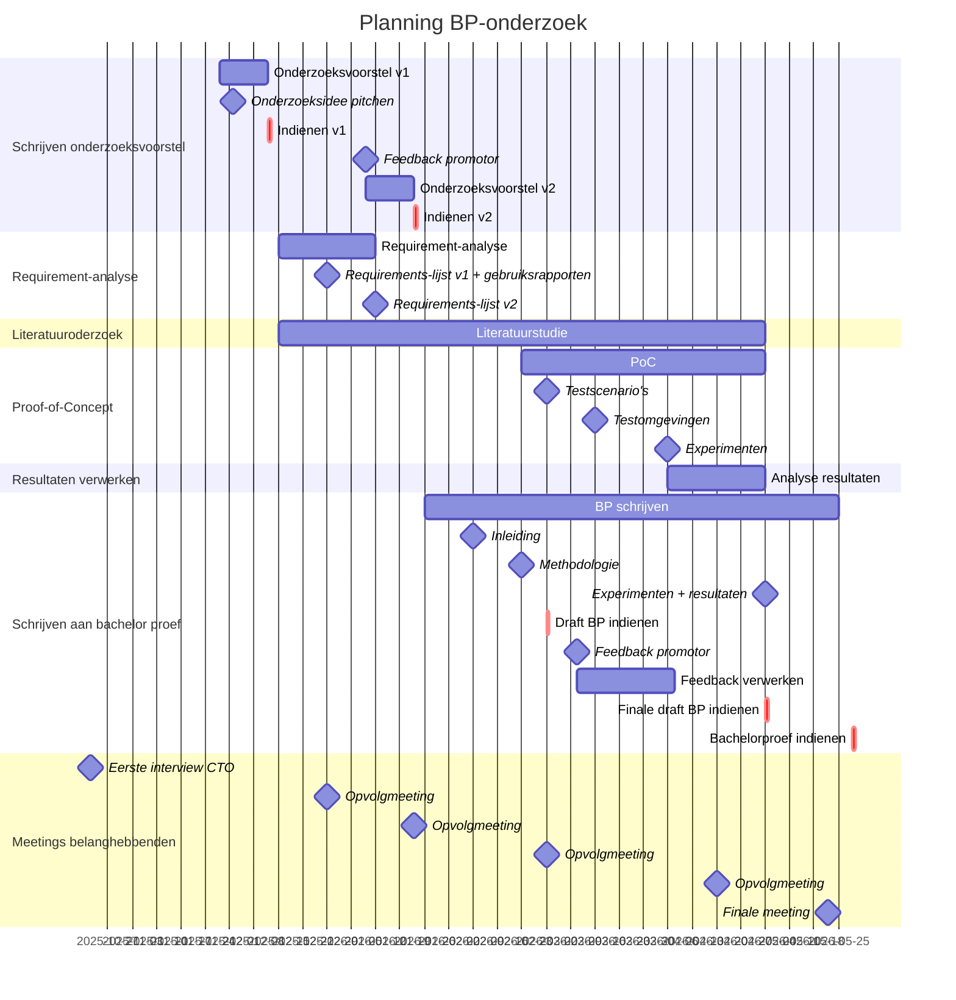

# Fase 5. Methodologie

- **Werktitel onderzoeksvoorstel:** Optimalisatie van Azure Functions: van Dedicated Plan naar Premium plan of hosting op Azure Container Apps
- **Student 1:** Wauters, Andy, TIAO
- **URL Github repo:** <https://github.com/HoGentTIN/paper-research-methods-nl-24-25-rmwauters>

## Plan van aanpak

- **Fase 1: Requirementsanalyse**
    - **Doelstelling:** Een antwoord op de volgende deelvragen:
        - Wat zijn de beperkingen van de huidige Azure Functions met Dedicated plan in termen van kosten, schaalbaarheid en prestaties en welke prestatieproblemen treden er op bij een hoge belasting?
        - Wat maakt de huidige Azure Functions dynamisch en welke architecturale en technische factoren zijn hierbij belangrijk?
        - Aan welke eisen moet een nieuwe oplossing voldoen op vlak van kosten, schaalbaarheid en prestaties om als succesvol aanzien te worden? 
    - **Aanpak:**
        - Analyse huidig systeem
        - Interview met CTO belanghebbenden 
    - **Resultaat, deliverable(s):** Requirementslijst
- **Fase 2: Literatuurstudie**
    - **Doelstelling:** Een antwoord op de volgende deelvraag: "Wat zijn de belangrijkste technische verschillen in schaalbaarheid, kostenstructuur en prestaties tussen Azure Functions met Dedicated plan en het Premium plan of Azure Container Apps?".
    - **Aanpak:**
        - Literatuurstudie
        - Opvolgmeetings om longlist en shortlist te bespreken en een stand van zaken mee te geven. 
    - **Resultaat, deliverable(s):** Longlist en shortlist alternatieven
- **Fase 3: Proof-of-Concept**
    - **Doelstelling:** Een antwoord op de volgende deelvraag: "Wat zijn de architecturale overwegingen en uitdagingen bij een migratie van Dedicated plan naar het Premium plan of Azure Container Apps?".
    - **Aanpak:**
        - Opzetten testomgeving
        - Opzetten testscenario's
        - Maken van scripts en commando's voor automatisering benchmarks
        - Benchmarking van schaalbaarheid, prestaties en kosten in verschillende scenario's en omgevingen 
    - **Resultaat, deliverable(s):** CSV met resultaten, proefopstelling, scripts/commando's
- **Fase 4: Verwerking resultaten**
    - **Doelstelling:** Een antwoord op de volgende deelvraag: "Welke impact heeft een migratie van Azure Functions met Dedicated plan naar Premium plan en Azure Container Apps op de prestaties, kosten en schaalbaarheid bij een dynamische belasting en wat is de superieure oplossing in deze context?".
    - **Aanpak:**
        - Analyse resultaten
        - Datavisualisatie door python
        - Statistische testen
    - **Resultaat, deliverable(s):** Advies, best practices, datavisualisatie

## Verloop

Gebruik (een) Mermaid-diagram(men) om de stappen of het tijdverloop de visualiseren (flowchart en/of Gantt-diagram; zie instructies).

